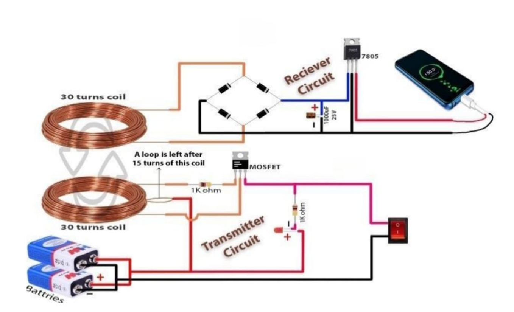

# ⚡ Wireless Power Transmission for Mobile Charging

> 🎓 Mini Project | 2022–2023  
> 🏢 SJC Institute of Technology  
> 🧠 Guided by: Dr. S. Bhargavi, Professor, Dept. of ECE  
> 🏅 Presented at IEEE National Conference

---

## 🚀 Project Overview

This project implements a **wireless mobile charging system** using inductive coupling — aiming to reduce dependency on wired chargers and demonstrate a safe, efficient, and universal charging alternative.

Key Features:
- 🔋 Wire-free charging using inductive coupling
- 🔄 Transmitter and Receiver circuits
- 📱 5V regulated DC output for mobile charging
- 📈 Efficient energy transfer up to ~6cm distance

---

## 🔧 Technologies & Components

- **Coils**: Copper transmission & receiver coils
- **MOSFET**: IRFZ44N for switching
- **Regulation**: Rectifier circuit + 5V Regulator
- **Power Source**: 9V Battery
- **Others**: Diodes, Capacitor (1000μF/25V), USB port

---

## 📐 System Block Diagram

---

## 🎯 Objectives

- ✅ Eliminate the need for charging cables
- ✅ Increase safety by reducing electrical contact risks
- ✅ Enable faster charging through improved coil alignment

---

## 👨‍💻 Team

| Name                   | Email                                                             |
| ---------------------  | ----------------------------------------------------------------- |
| Team Lead: Sudarshan G | [gsudarshan925@gmail.com](mailto:gsudarshan925@gmail.com)         |
| Shreyas S R            | [shreyasreddyssr15@gmail.com](mailto:shreyasreddyssr15@gmail.com) |
| S Upendra              | [lukkyupendra2002@gmail.com](mailto:lukkyupendra2002@gmail.com)   |
| Guide: Dr. S Bhargavi  | [bhargavi@sjcit.ac.in](mailto:bhargavi@sjcit.ac.in)               |

---

## 📄 Documentation

* 📘 [Mini Project Report](./documentation/mini-project-report.pdf)
* 📑 [IEEE Paper](./documentation/ieee-paper.pdf)
* 📊 [IEEE Presentation Slides](./documentation/ieee-presentation.pdf)

---

## 📊 Results and Discussion

The wireless charging system was successfully demonstrated using a 9V battery as the power source. Key observations:

* ✅ Effective power transfer was achieved up to **6 cm** with good coil alignment
* ⚡ Mobile devices charged reliably at **5V regulated output**
* 🔥 Minimal heat dissipation and good energy conversion efficiency
* 📶 Electromagnetic interference was found to be negligible in the tested range

These results confirm the feasibility of short-range wireless charging for low-power devices using inductive coupling.

---

## 🧠 What Recruiters Should Know

This project highlights:
- ✅ Your understanding of **power electronics**
- ✅ Hands-on **hardware implementation** & teamwork
- ✅ Participation in **national-level IEEE conference**
- ✅ Application of **circuit design**, **regulation**, and **component selection**

---

## 📬 Contact

- 📧 Email: [gsudarshan925@gmail.com](mailto:gsudarshan925@gmail.com)
- 💼 LinkedIn: [https://linkedin.com/in/YOUR-USERNAME](https://linkedin.com/in/YOUR-USERNAME)
